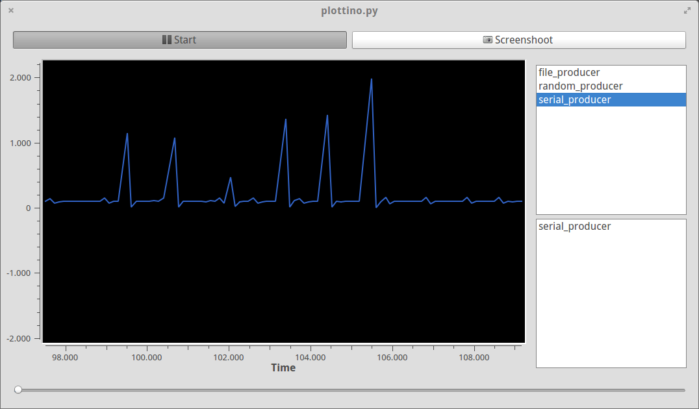
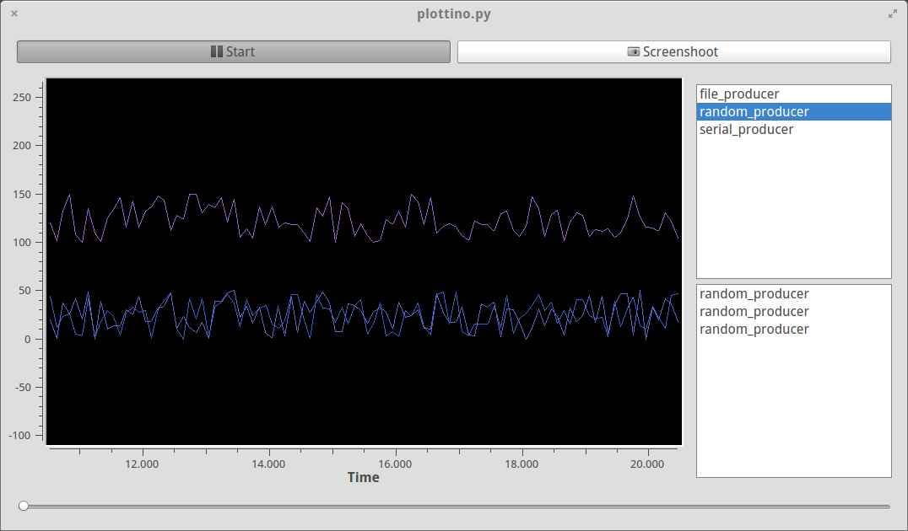

# PLOTTINO

I spent too much time searching for a good way to plot data
sent from an arduino without success.
So here it is **plottino**.  It's python, PyQt and PyQwt

It's modular, so you can write an input module yourself.

It's just started so i'm currently testing module structure.

## Screenshoot

An example of plotting data from an arduino running [enlight](/lesion/enlight)

Another example of plotting data from three different random source:

